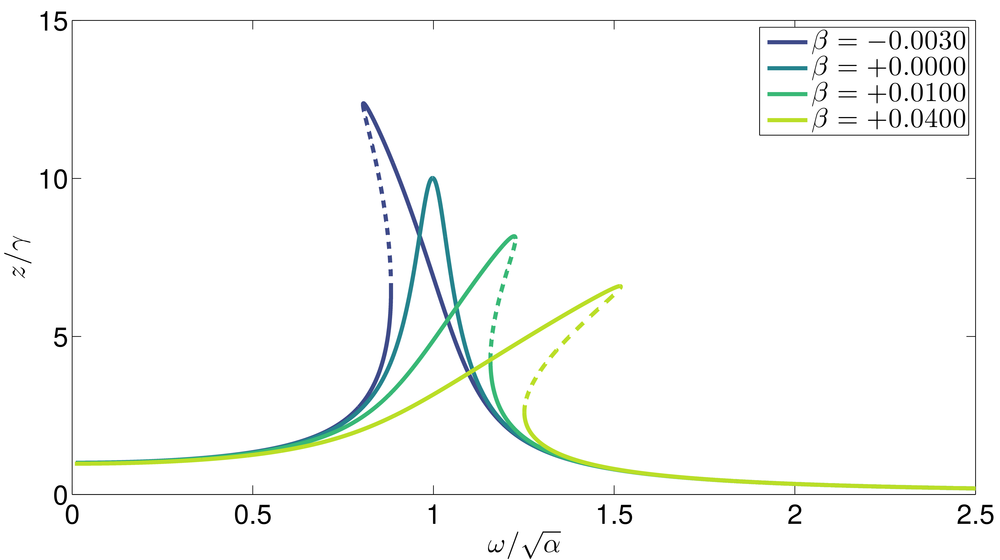

# Curso: Dinámica de sistemas físicos

## Semestre
> Enero 2023

## Impartido por:
<ul>
  <li> Dr. Jesús Emmanuel Solís Pérez </li>
  <li> Email: jsolisp@unam.mx </li>
</ul>

## Página personal del profesor
> [https://sites.google.com/view/je-solis-perez](https://sites.google.com/view/je-solis-perez)

## Prerequisitos
<ol>
 <li>Cálculo I y II, Álgebra Lineal y Geometría Analítica, Variable Compleja </li>
</ol>

## Software requerido y herramientas
<ol>
 <li>MATLAB y MATLAB Simulink</li>
 <li>Sistema operativo: Windows 10, Linux, o macOS.</li>
 <li>Web Browser: Google Chrome, Opera o Firefox.</li>
 <li>Markdown para escribir documentación.</li>
 <li>Sistema de control de versiones.</li>
</ol>

## Contenido del curso

| **Unidad** | **Tema** | **Contenido** | **Material** |
|:---:|:---:|:---|:---:|
| I | Introducción a la dinámica de los sistemas lineales | <li>Conceptos básicos.</li> <li>Modelos analíticos de estudio de sistemas.</li> | <ol><li>[Código (Live Script)](codes/JESP_01_Introduccion_dinamica.ipynb)</li> <li>[PDF](pdf/.pdf)</li> </ol> |
| II | Antecedentes matemáticos | <li>Álgebra Lineal.</li> <li>Ecuaciones Diferenciales.</li> <li> Transformada de Fourier. </li> <li> Transformada de Laplace. </li> | <ol><li>[Código (Live Script)](codes/JESP_02_Antecedentes_mat.ipynb)</li> <li>[PDF](pdf/.ipynb)</li> </ol> |
| III | Modelado en el dominio de la frecuencia | <li> Función de Transferencia. </li> <li> Modelado de sistemas mecánicos. </li> <li> Modelado de sistemas eléctricos y electro-mecánicos. </li> <li> Modelado de sistemas hidráulicos y térmicos. </li> <li> Otro tipo de sistemas. </li> | <ol><li>[Código (Live Script)](codes/JESP_03_Modelado_frec.ipynb)</li> <li>[PDF](pdf/.pdf)</li> </ol> |
| IV | Modelado en el dominio del tiempo | <li> Ecuaciones en variables de estado. </li> <li> Modelado de sistemas mediante ecuaciones de estado. </li> <li> Relación entre el modelo en variables de estado y la función de transferencia. </li> | <ol><li>[Código (Live Script)](codes/.ipynb)</li> <li>[PDF](pdf/.pdf)</li> </ol> |
| V | Análisis de dinámicas de sistemas en el dominio del tiempo | <li> Respuesta en el tiempo. </li> <li> Análisis de los puntos de equilibrio. </li> <li> Estabilidad de los puntos de equilibrio. </li> | <ol><li>[Código (Live Script)](codes/.ipynb)</li> <li>[PDF](pdf/.pdf)</li> </ol> |
| VI | Análisis de sistemas dinámicos en el dominio de la frecuencia | | <ol><li>[Código (Live Script)](codes/.ipynb)</li> <li>[PDF](pdf/.pdf)</li> </ol> |

## Libros de apoyo
<ol>
 <li> Ogata, K. (1978). System dynamics. Englewood Cliffs. </li>
 <li> Nise, N. S. (2020). Control systems engineering. John Wiley & Sons. </li>
</ol>

##### Última modificación 11 de diciembre de 2022
